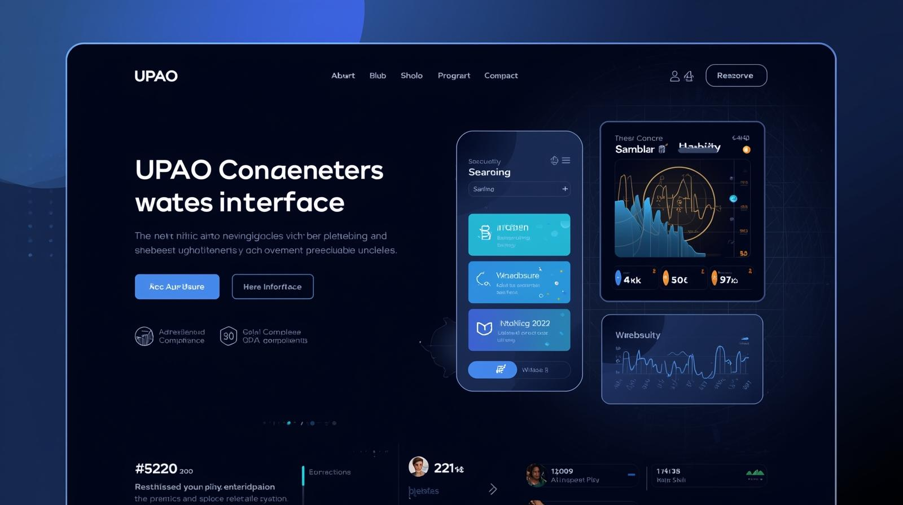
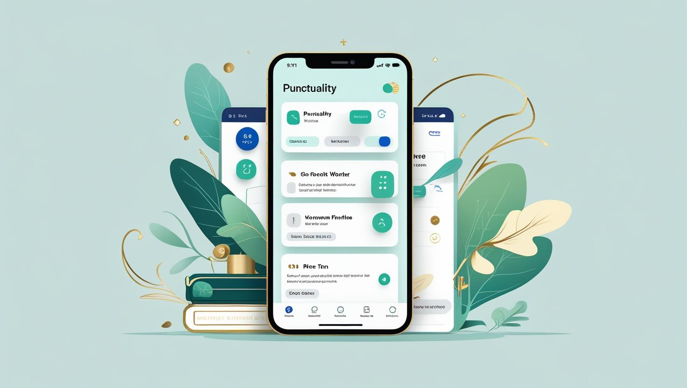
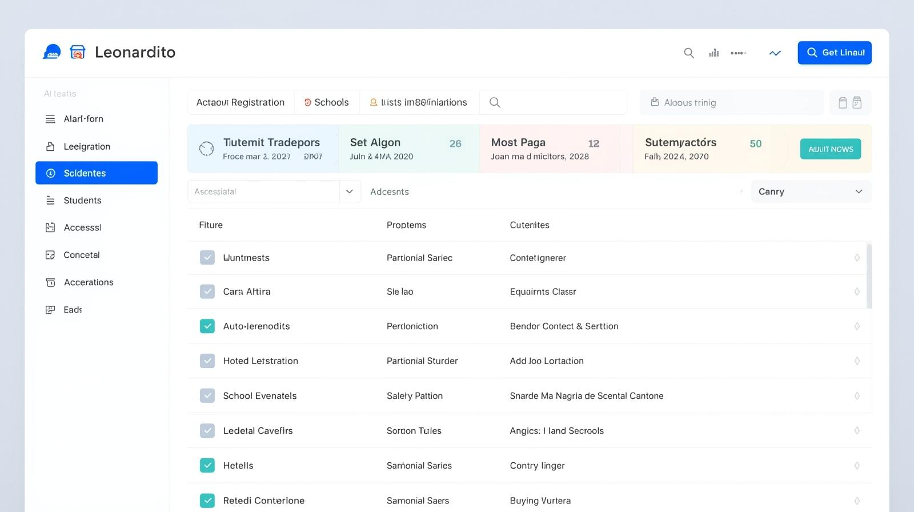

  

  

<h2>🗺️ Bitácora del Capitán</h2>

¡Bienvenido a mi océano digital! 🌊 Soy <b>Alixter</b>, un desarrollador que navega las aguas del Full Stack. No solo escribo líneas de código, construyo soluciones.

<b>🔭 Misión Actual:</b> 
Desarrollar aplicaciones web escalables que conecten personas.  
<b>🌱 Aprendiendo (Haki de Observación):</b> 
Estoy profundizando en <i>Arquitectura de Software</i> y <i>Docker</i>.  
<b>⚡ Dato Curioso:</b> 
Al igual que Zoro, a veces me pierdo... pero siempre encuentro la solución al bug. ⚔️

 
 

<h2 align="center">⚔️ Arsenal y Frutas del Diablo (Skills)</h2>

  

<h2 align="center">🏆 Carteles de Búsqueda (Proyectos)</h2>

> 
> <h3>🎮 CompetenciasUPAO</h3>
> <i>Plataforma de competición académica.</i>
>   
> 🛠️ <b>Arsenal:</b>  
>  
> 🏴‍☠️ <b>Estado:</b> 
>  

 

> 
> <h3>📱 Puntualito</h3>
> <i>Aplicación móvil para gestión de asistencia.</i>
>   
> 🛠️ <b>Arsenal:</b>  
>  
> 🏴‍☠️ <b>Estado:</b> 
>  

 

> 
> <h3>🍔 Leonardito</h3>
> <i>Una experiencia culinaria digital y dashboard.</i>
>   
> 🛠️ <b>Arsenal:</b>  
>  
> 🏴‍☠️ <b>Estado:</b> 
>  

<h2 align="center">🌊 Dominio de los Mares (Stats)</h2>

<table border="0" width="100%">
  <tr>
    <td align="center" width="50%">
      
    </td>
    <td align="center" width="50%">
      
    </td>
  </tr>
</table>

  

<h2 align="center">🐌 Den Den Mushi (Contacto)</h2>

  
¡Llama a mi caracol comunicador si quieres colaborar!

  
  
  

 

  

